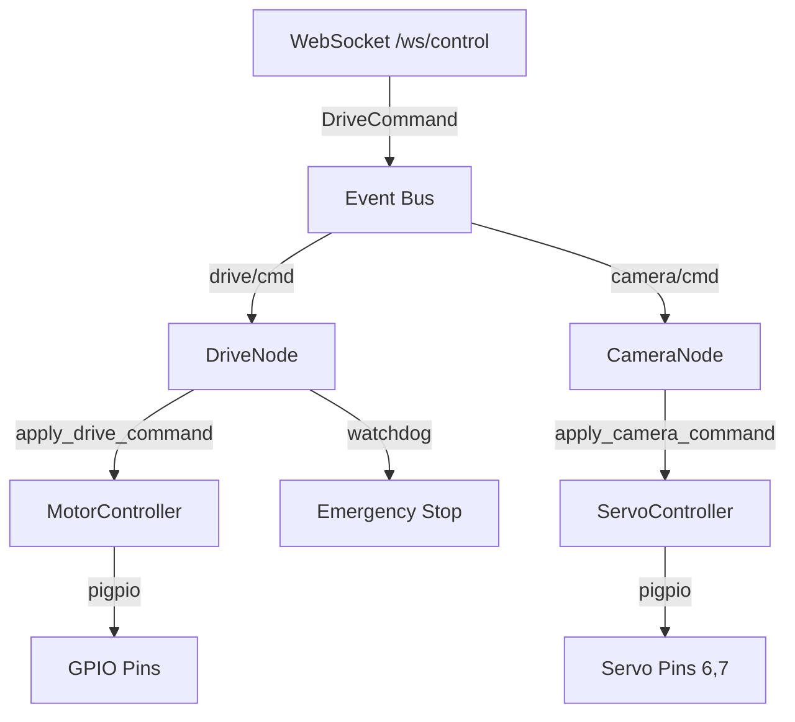

# План интеграции управления моторами

## Общая архитектура

Используем единую библиотеку `pigpio` для управления как камерой, так и моторами. Сохраняем существующую архитектуру проекта (event bus, async, watchdog), изменяем только конфигурацию пинов и реализацию hardware layer.



## Конфигурация пинов (из примера)

**Моторы (4 DC мотора, танковое управление):**

- Левая сторона: L_IN1=20, L_IN2=21, L_PWM1=0, L_IN3=22, L_IN4=23, L_PWM2=1
- Правая сторона: R_IN1=24, R_IN2=25, R_PWM1=12, R_IN3=26, R_IN4=27, R_PWM2=13

**Камера (сервоприводы):**

- Pan (влево/вправо): GPIO 7
- Tilt (вверх/вниз): GPIO 6

## Алгоритм танкового управления

```python
# Преобразование (vx, steer) в мощность левой/правой стороны
left_power = vx - steer
right_power = vx + steer

# Нормализация
max_abs = max(abs(left_power), abs(right_power))
if max_abs > 1.0:
    left_power /= max_abs
    right_power /= max_abs
```

---

## Справочная информация

### Таблица GPIO пинов (BCM нумерация)

| Функция | GPIO BCM | Физический пин | Назначение |

|---------|----------|----------------|------------|

| L_IN1 | 20 | 38 | Левый мотор 1 - направление |

| L_IN2 | 21 | 40 | Левый мотор 1 - направление |

| L_PWM1 | 0 | 27 | Левый мотор 1 - PWM скорость |

| L_IN3 | 22 | 15 | Левый мотор 2 - направление |

| L_IN4 | 23 | 16 | Левый мотор 2 - направление |

| L_PWM2 | 1 | 28 | Левый мотор 2 - PWM скорость |

| R_IN1 | 24 | 18 | Правый мотор 1 - направление |

| R_IN2 | 25 | 22 | Правый мотор 1 - направление |

| R_PWM1 | 12 | 32 | Правый мотор 1 - PWM (аппаратный) |

| R_IN3 | 26 | 37 | Правый мотор 2 - направление |

| R_IN4 | 27 | 13 | Правый мотор 2 - направление |

| R_PWM2 | 13 | 33 | Правый мотор 2 - PWM (аппаратный) |

| Pan Servo | 7 | 26 | Сервопривод камеры (влево/вправо) |

| Tilt Servo | 6 | 31 | Сервопривод камеры (вверх/вниз) |

### Команды управления в веб-интерфейсе

Управление осуществляется через **кнопки в браузере** (не клавиатура!).

**Управление движением (Drive Control):**

- Кнопка **▲ Forward** - движение вперед (vx = 1.0, steer = 0)
- Кнопка **▼ Backward** - движение назад (vx = -1.0, steer = 0)
- Кнопка **◀ Left** - поворот влево на ходу (vx = 0.5, steer = -1.0)
- Кнопка **▶ Right** - поворот вправо на ходу (vx = 0.5, steer = 1.0)
- Кнопка **⬛ STOP** - экстренная остановка (emergency_stop)
- При отсутствии команд - автоматическая остановка через 0.5с (watchdog)

**Управление камерой (Camera Control - D-Pad):**

- Кнопка **▲** (cam-up) - наклон вверх
- Кнопка **▼** (cam-down) - наклон вниз
- Кнопка **◀** (cam-left) - поворот влево
- Кнопка **▶** (cam-right) - поворот вправо
- Кнопка **●** (cam-home) - вернуть камеру в центральное положение
- Клик = дискретный шаг, Удержание = плавное движение

**Примечание:** Веб-интерфейс доступен по адресу `http://<IP_Raspberry_Pi>:8000`

### Примеры команд движения (vx, steer)

| Кнопка в UI | vx | steer | Результат |

|-------------|-----|-------|-----------|

| Forward | 1.0 | 0.0 | Вперед полная скорость |

| Backward | -1.0 | 0.0 | Назад полная скорость |

| Left | 0.5 | -1.0 | Поворот влево на ходу (L=-0.5, R=1.5 → нормализовано) |

| Right | 0.5 | 1.0 | Поворот вправо на ходу (L=1.5, R=-0.5 → нормализовано) |

| STOP | 0.0 | 0.0 | Полная остановка (emergency_stop) |

**Как работает нормализация при поворотах:**

```python
# Пример: Left button (vx=0.5, steer=-1.0)
left_power = 0.5 - (-1.0) = -0.5   # Левая сторона назад
right_power = 0.5 + (-1.0) = 1.5   # Правая сторона вперед быстро

# max_abs = 1.5 > 1.0, нормализуем:
left_power = -0.5 / 1.5 = -0.33
right_power = 1.5 / 1.5 = 1.0
# Результат: крутой поворот влево (левая назад 33%, правая вперед 100%)
```

---

## Подготовка системы

### 1. Установка и настройка pigpiod

**Проверка установки pigpio:**

```bash
# Проверить, установлен ли pigpio
dpkg -l | grep pigpio

# Если не установлен:
sudo apt update
sudo apt install pigpio python3-pigpio
```

**Запуск демона pigpiod:**

```bash
# Разовый запуск
sudo pigpiod

# Проверка статуса
sudo systemctl status pigpiod

# Автозапуск при загрузке
sudo systemctl enable pigpiod
sudo systemctl start pigpiod
```

**Проверка подключения:**

```bash
# Тест подключения к pigpiod
pigs hwver
# Должен вернуть версию Raspberry Pi (например, 17 для Pi 4)
```

### 2. Проверка GPIO пинов

**Проверка, что пины не заняты:**

```bash
# Показать состояние всех GPIO
gpio readall

# Проверить конкретный пин (например, GPIO 12)
gpio -g read 12
```

**Освобождение занятых пинов:**

```bash
# Сброс всех GPIO
gpio reset

# Или перезагрузка
sudo reboot
```

### 3. Запуск приложения

**Создание виртуального окружения (если еще нет):**

```bash
cd /path/to/pi_drive_stream
python3 -m venv --system-site-packages venv
source venv/bin/activate
```

**Установка зависимостей:**

```bash
pip install -r requirements-pi.txt
```

**Запуск с логами:**

```bash
# Запуск основного приложения
python main.py

# Или через start.sh (если есть)
./start.sh
```

**Проверка логов:**

```bash
# Смотреть логи в реальном времени
tail -f /var/log/syslog | grep pigpio
```

### 4. Доступ к веб-интерфейсу

```bash
# Узнать IP адрес Raspberry Pi
hostname -I

# Открыть в браузере:
# http://<IP_адрес>:8000
```

---

## Этап 1: Управление камерой

**Цель:** Адаптировать существующее управление камерой под пины из примера.

### Файлы для изменения:

**1. [`app/config.py`](app/config.py)** - изменить пины камеры:

```python
class CameraConfig(BaseModel):
    # Изменить пины на значения из примера
    pan_gpio_pin: int = Field(7, ge=0, description="GPIO пин для pan сервопривода")
    tilt_gpio_pin: int = Field(6, ge=0, description="GPIO пин для tilt сервопривода")
    # Остальные параметры без изменений
```

### Тестирование этапа 1:

- Запустить приложение
- Открыть веб-интерфейс в браузере: `http://<IP_Raspberry_Pi>:8000`
- Проверить управление камерой через кнопки D-Pad в веб-интерфейсе (▲▼◀▶)
- Убедиться, что сервоприводы работают на новых пинах (6, 7)

---

## Этап 2: Движение вперед

**Цель:** Создать базовую инфраструктуру для управления моторами и реализовать движение вперед.

### Файлы для создания/изменения:

**1. [`app/config.py`](app/config.py)** - добавить конфигурацию моторов:

```python
class MotorConfig(BaseModel):
    """Настройки управления DC моторами"""

    # Левая сторона (2 мотора)
    left_in1: int = Field(20, description="Левый мотор 1 - направление IN1")
    left_in2: int = Field(21, description="Левый мотор 1 - направление IN2")
    left_pwm1: int = Field(0, description="Левый мотор 1 - скорость PWM")
    left_in3: int = Field(22, description="Левый мотор 2 - направление IN3")
    left_in4: int = Field(23, description="Левый мотор 2 - направление IN4")
    left_pwm2: int = Field(1, description="Левый мотор 2 - скорость PWM")

    # Правая сторона (2 мотора)
    right_in1: int = Field(24, description="Правый мотор 1 - направление IN1")
    right_in2: int = Field(25, description="Правый мотор 1 - направление IN2")
    right_pwm1: int = Field(12, description="Правый мотор 1 - скорость PWM (аппаратный)")
    right_in3: int = Field(26, description="Правый мотор 2 - направление IN3")
    right_in4: int = Field(27, description="Правый мотор 2 - направление IN4")
    right_pwm2: int = Field(13, description="Правый мотор 2 - скорость PWM (аппаратный)")

    # Параметры PWM
    pwm_frequency: int = Field(100, description="Частота PWM (Hz)")
    pwm_range: int = Field(100, description="Диапазон duty cycle (0-100)")

    # Логирование
    enable_logging: bool = Field(True, description="Логировать команды моторов")

# В класс Config добавить:
class Config(BaseModel):
    server: ServerConfig = Field(default_factory=ServerConfig)
    drive: DriveConfig = Field(default_factory=DriveConfig)
    video: VideoConfig = Field(default_factory=VideoConfig)
    camera: CameraConfig = Field(default_factory=CameraConfig)
    motor: MotorConfig = Field(default_factory=MotorConfig)  # Новое поле
    overlay: OverlayConfig = Field(default_factory=OverlayConfig)
```

**2. [`app/hw/motors.py`](app/hw/motors.py)** - новый файл с реализацией через pigpio:

```python
"""
DC motor control via pigpio.
Manages 4 DC motors in tank drive configuration.
"""

import logging
from app.config import config
from app.messages import DriveCommand

logger = logging.getLogger(__name__)

try:
    import pigpio  # type: ignore[import-not-found]
    PIGPIO_AVAILABLE = True
except ImportError:
    pigpio = None  # type: ignore[assignment]
    PIGPIO_AVAILABLE = False

_pi: object | None = None


def _get_pi():
    """Ленивая инициализация pigpio"""
    global _pi
    if not PIGPIO_AVAILABLE or pigpio is None:
        raise RuntimeError("pigpio is not available on this platform")
    if _pi is None:
        _pi = pigpio.pi()
        if not _pi.connected:
            raise RuntimeError(
                "Cannot connect to pigpiod. Is it running? (sudo systemctl start pigpiod)"
            )
        _initialize_motors()
    return _pi


def _initialize_motors() -> None:
    """Инициализация GPIO пинов для моторов"""
    if not PIGPIO_AVAILABLE or _pi is None:
        return

    cfg = config.motor

    # Настройка пинов направления (цифровые выходы)
    for pin in [cfg.left_in1, cfg.left_in2, cfg.left_in3, cfg.left_in4,
                cfg.right_in1, cfg.right_in2, cfg.right_in3, cfg.right_in4]:
        _pi.set_mode(pin, pigpio.OUTPUT)
        _pi.write(pin, 0)  # Начальное состояние LOW

    # Настройка PWM пинов
    for pin in [cfg.left_pwm1, cfg.left_pwm2, cfg.right_pwm1, cfg.right_pwm2]:
        _pi.set_PWM_frequency(pin, cfg.pwm_frequency)
        _pi.set_PWM_range(pin, cfg.pwm_range)
        _pi.set_PWM_dutycycle(pin, 0)  # Начальная скорость = 0


def _calculate_motor_powers(vx: float, steer: float) -> tuple[float, float]:
    """
    Преобразование (vx, steer) в мощность левой/правой стороны.

    Args:
        vx: Скорость вперед/назад [-1..1]
        steer: Поворот влево/вправо [-1..1]

    Returns:
        (left_power, right_power) в диапазоне [-1..1]
    """
    left_power = vx - steer
    right_power = vx + steer

    # Нормализация (если вышли за пределы [-1, 1])
    max_abs = max(abs(left_power), abs(right_power))
    if max_abs > 1.0:
        left_power /= max_abs
        right_power /= max_abs

    return left_power, right_power


def _set_motor_side(
    in1: int, in2: int, pwm1: int,
    in3: int, in4: int, pwm2: int,
    power: float
) -> None:
    """
    Установить скорость и направление для одной стороны (2 мотора).

    Args:
        in1, in2, pwm1: Пины первого мотора
        in3, in4, pwm2: Пины второго мотора
        power: Мощность [-1..1], знак определяет направление
    """
    if not PIGPIO_AVAILABLE or _pi is None:
        return

    cfg = config.motor
    duty_cycle = int(abs(power) * cfg.pwm_range)

    if power > 0:
        # Вперед (ЭТАП 2: только это направление активно)
        _pi.write(in1, 0)
        _pi.write(in2, 1)
        _pi.write(in3, 1)
        _pi.write(in4, 0)
    elif power < 0:
        # Назад (ЭТАП 3: пока заблокировано)
        _pi.write(in1, 0)
        _pi.write(in2, 0)
        _pi.write(in3, 0)
        _pi.write(in4, 0)
        duty_cycle = 0  # Блокируем назад на этапе 2
    else:
        # Стоп
        _pi.write(in1, 0)
        _pi.write(in2, 0)
        _pi.write(in3, 0)
        _pi.write(in4, 0)

    _pi.set_PWM_dutycycle(pwm1, duty_cycle)
    _pi.set_PWM_dutycycle(pwm2, duty_cycle)


async def apply_drive_command(cmd: DriveCommand) -> None:
    """
    Применить команду управления движением.

    Args:
        cmd: DriveCommand с vx (скорость) и steer (поворот)
    """
    if not PIGPIO_AVAILABLE:
        return

    try:
        pi = _get_pi()
        cfg = config.motor

        # Преобразование команды в мощность сторон
        left_power, right_power = _calculate_motor_powers(cmd.vx, cmd.steer)

        # ЭТАП 2: Разрешаем только движение вперед (vx > 0, steer == 0)
        if cmd.vx > 0 and cmd.steer == 0:
            # Применение к левой стороне
            _set_motor_side(
                cfg.left_in1, cfg.left_in2, cfg.left_pwm1,
                cfg.left_in3, cfg.left_in4, cfg.left_pwm2,
                left_power
            )

            # Применение к правой стороне
            _set_motor_side(
                cfg.right_in1, cfg.right_in2, cfg.right_pwm1,
                cfg.right_in3, cfg.right_in4, cfg.right_pwm2,
                right_power
            )

            if cfg.enable_logging:
                print(f"[MOTOR] vx={cmd.vx:.2f}, steer={cmd.steer:.2f} -> L={left_power:.2f}, R={right_power:.2f}")
        else:
            # Стоп (любые другие команды на этапе 2)
            _set_motor_side(
                cfg.left_in1, cfg.left_in2, cfg.left_pwm1,
                cfg.left_in3, cfg.left_in4, cfg.left_pwm2,
                0.0
            )
            _set_motor_side(
                cfg.right_in1, cfg.right_in2, cfg.right_pwm1,
                cfg.right_in3, cfg.right_in4, cfg.right_pwm2,
                0.0
            )

    except RuntimeError as e:
        logger.error("Failed to control motors: %s", e)
    except Exception as e:
        logger.error("Unexpected error in motor control: %s", e)


def cleanup_motors() -> None:
    """Освобождение ресурсов при выключении"""
    global _pi
    if not PIGPIO_AVAILABLE or _pi is None:
        return

    cfg = config.motor

    # Остановка всех моторов
    for pin in [cfg.left_pwm1, cfg.left_pwm2, cfg.right_pwm1, cfg.right_pwm2]:
        _pi.set_PWM_dutycycle(pin, 0)

    # Сброс направлений
    for pin in [cfg.left_in1, cfg.left_in2, cfg.left_in3, cfg.left_in4,
                cfg.right_in1, cfg.right_in2, cfg.right_in3, cfg.right_in4]:
        _pi.write(pin, 0)

    _pi.stop()
    _pi = None
```

**3. [`app/nodes/drive.py`](app/nodes/drive.py)** - изменить импорт:

```python
# Было:
from app.hw.motors_stub import apply_drive_command

# Станет:
from app.hw.motors import apply_drive_command
```

**4. [`main.py`](main.py)** - добавить cleanup для моторов:

```python
from app.hw.servos import cleanup_servo
from app.hw.motors import cleanup_motors  # Новый импорт
from app.video import cleanup_camera


def signal_handler(sig, frame):
    print("\n[SHUTDOWN] Cleaning up resources...")
    cleanup_servo()
    cleanup_motors()  # Новый вызов
    cleanup_camera()
    sys.exit(0)
```

### Тестирование этапа 2:

- Запустить приложение
- Открыть веб-интерфейс в браузере
- Нажать кнопку **▲ Forward** в веб-интерфейсе
- Убедиться, что все 4 мотора вращаются вперед
- Проверить, что другие направления (назад, повороты) заблокированы
- Проверить логи: `[MOTOR] vx=1.00, steer=0.00 -> L=1.00, R=1.00`

---

## Этап 3: Движение назад

**Цель:** Разблокировать движение назад.

### Файлы для изменения:

**1. [`app/hw/motors.py`](app/hw/motors.py)** - разблокировать назад в `_set_motor_side`:

```python
def _set_motor_side(...):
    # ... (код без изменений до elif power < 0)

    elif power < 0:
        # Назад (ЭТАП 3: разблокировано)
        _pi.write(in1, 1)
        _pi.write(in2, 0)
        _pi.write(in3, 0)
        _pi.write(in4, 1)
        # Убрать строку: duty_cycle = 0
```

**2. [`app/hw/motors.py`](app/hw/motors.py)** - изменить условие в `apply_drive_command`:

```python
# Было (этап 2):
if cmd.vx > 0 and cmd.steer == 0:

# Станет (этап 3):
if cmd.vx != 0 and cmd.steer == 0:  # Разрешаем вперед И назад
```

### Тестирование этапа 3:

- Запустить приложение
- Нажать кнопку **▼ Backward** в веб-интерфейсе
- Убедиться, что все 4 мотора вращаются назад
- Проверить, что движение вперед (кнопка Forward) продолжает работать
- Проверить логи: `[MOTOR] vx=-1.00, steer=0.00 -> L=-1.00, R=-1.00`

---

## Этап 4: Повороты влево

**Цель:** Реализовать поворот влево (левая сторона медленнее/назад, правая быстрее/вперед).

### Файлы для изменения:

**1. [`app/hw/motors.py`](app/hw/motors.py)** - расширить условие в `apply_drive_command`:

```python
# Было (этап 3):
if cmd.vx != 0 and cmd.steer == 0:

# Станет (этап 4):
if cmd.vx != 0 or cmd.steer < 0:  # Разрешаем вперед, назад, влево
```

### Тестирование этапа 4:

- Запустить приложение
- Нажать кнопку **◀ Left** в веб-интерфейсе
- Убедиться, что машина поворачивает влево (левая сторона назад, правая вперед)
- Проверить логи: `[MOTOR] vx=0.50, steer=-1.00 -> L=-0.33, R=1.00` (нормализовано)
- Убедиться, что движение вперед и назад продолжают работать

---

## Этап 5: Повороты вправо

**Цель:** Реализовать поворот вправо (правая сторона медленнее/назад, левая быстрее/вперед).

### Файлы для изменения:

**1. [`app/hw/motors.py`](app/hw/motors.py)** - полностью разблокировать в `apply_drive_command`:

```python
# Было (этап 4):
if cmd.vx != 0 or cmd.steer < 0:

# Станет (этап 5):
# Убрать условие полностью - разрешаем все направления
# Код становится просто:

async def apply_drive_command(cmd: DriveCommand) -> None:
    if not PIGPIO_AVAILABLE:
        return

    try:
        pi = _get_pi()
        cfg = config.motor

        left_power, right_power = _calculate_motor_powers(cmd.vx, cmd.steer)

        # Применение к левой стороне
        _set_motor_side(
            cfg.left_in1, cfg.left_in2, cfg.left_pwm1,
            cfg.left_in3, cfg.left_in4, cfg.left_pwm2,
            left_power
        )

        # Применение к правой стороне
        _set_motor_side(
            cfg.right_in1, cfg.right_in2, cfg.right_pwm1,
            cfg.right_in3, cfg.right_in4, cfg.right_pwm2,
            right_power
        )

        if cfg.enable_logging:
            print(f"[MOTOR] vx={cmd.vx:.2f}, steer={cmd.steer:.2f} -> L={left_power:.2f}, R={right_power:.2f}")

    except RuntimeError as e:
        logger.error("Failed to control motors: %s", e)
    except Exception as e:
        logger.error("Unexpected error in motor control: %s", e)
```

### Тестирование этапа 5:

- Запустить приложение
- Нажать кнопку **▶ Right** в веб-интерфейсе
- Убедиться, что машина поворачивает вправо (правая сторона назад, левая вперед)
- Проверить логи: `[MOTOR] vx=0.50, steer=1.00 -> L=1.00, R=-0.33` (нормализовано)
- Протестировать все направления: Forward, Backward, Left, Right
- Проверить кнопку **⬛ STOP** - машина должна остановиться мгновенно

---

## Финальная проверка

После завершения всех этапов:

1. Проверить watchdog (отпустить клавиши - машина должна остановиться через 0.5с)
2. Проверить emergency stop (ESC или отключение WebSocket)
3. Проверить плавность переходов между направлениями
4. Проверить логирование команд
5. Проверить корректную очистку ресурсов при shutdown

## Примечания

- Все изменения инкрементальны - каждый этап добавляет функциональность
- Существующая архитектура сохраняется полностью
- Используется единая библиотека pigpio
- Watchdog и безопасность работают на всех этапах
- Можно вернуться к stub, просто изменив импорт в `drive.py`

---

## Диагностика и решение проблем

### Проблема 1: Не удается подключиться к pigpiod

**Симптом:** Ошибка `Cannot connect to pigpiod. Is it running?`

**Решения:**

```bash
# 1. Проверить, запущен ли pigpiod
sudo systemctl status pigpiod

# 2. Если не запущен - запустить
sudo systemctl start pigpiod

# 3. Если сервис не существует - запустить напрямую
sudo pigpiod

# 4. Проверить, не занят ли порт
sudo netstat -tulpn | grep 8888

# 5. Убить старый процесс и перезапустить
sudo killall pigpiod
sudo pigpiod
```

### Проблема 2: Моторы крутятся не в ту сторону

**Симптом:** При команде "вперед" моторы крутятся назад (или наоборот)

**Решение:** Инвертировать логику направления в функции `_set_motor_side`:

```python
# Если левая сторона крутится не туда, поменять IN1 <-> IN2 и IN3 <-> IN4
if power > 0:
    # Было:
    _pi.write(in1, 0)
    _pi.write(in2, 1)
    # Станет:
    _pi.write(in1, 1)
    _pi.write(in2, 0)
```

**Диагностика каждого мотора отдельно:**

Создайте тестовый скрипт `test_motor.py`:

```python
import pigpio
import time

pi = pigpio.pi()

# Тест левого мотора 1 (пины 20, 21, 0)
print("Тест L1: вперед")
pi.write(20, 0)
pi.write(21, 1)
pi.set_PWM_dutycycle(0, 50)
time.sleep(2)
pi.set_PWM_dutycycle(0, 0)

print("Тест L1: назад")
pi.write(20, 1)
pi.write(21, 0)
pi.set_PWM_dutycycle(0, 50)
time.sleep(2)
pi.set_PWM_dutycycle(0, 0)

# Повторить для L2, R1, R2
pi.stop()
```

### Проблема 3: Один или несколько моторов не работают

**Симптом:** Часть моторов крутится, часть - нет

**Проверки:**

```bash
# 1. Проверить, что пины не заняты другими процессами
gpio readall

# 2. Тест пина напрямую через pigpio
pigs w 12 1  # Установить GPIO 12 в HIGH
pigs w 12 0  # Установить GPIO 12 в LOW

# 3. Тест PWM
pigs hp 12 1500 50  # Аппаратный PWM на пине 12
```

**Возможные причины:**

- Проблема с драйвером моторов (L298N или аналог)
- Недостаточное питание (моторы требуют отдельный источник питания)
- Плохой контакт проводов
- Сгоревший канал драйвера

### Проблема 4: Сервоприводы камеры не работают

**Симптом:** Камера не поворачивается или дергается

**Решение:**

```bash
# 1. Проверить пины 6 и 7
pigs s 6 1500  # Центральное положение servo
pigs s 7 1500
```

**Если сервоприводы дергаются:**

- Проверить питание (должно быть стабильное 5V)
- Увеличить диапазон импульсов в config.py:
```python
servo_min_pulse: int = Field(500, ...)   # Уменьшить
servo_max_pulse: int = Field(2500, ...)  # Увеличить
```


### Проблема 5: Моторы не останавливаются (watchdog не работает)

**Симптом:** После отпускания клавиш моторы продолжают вращаться

**Проверки:**

```python
# В логах должны быть сообщения:
[MOTOR] vx=0.00, steer=0.00 -> L=0.00, R=0.00

# Проверить, что watchdog запущен в drive.py
print(f"Watchdog timeout: {self.timeout_s}s")
```

**Решение:** Проверить, что WebSocket соединение активно и событие bus работает.

### Проблема 6: Высокий CPU load от pigpiod

**Симптом:** pigpiod потребляет много CPU

**Решение:**

```bash
# Уменьшить частоту обновления PWM в конфиге
# pwm_frequency: 100 -> 50 Hz (в config.py)

# Или уменьшить sample rate pigpiod
sudo killall pigpiod
sudo pigpiod -s 10  # Sample rate 10 мкс (по умолчанию 5)
```

### Проблема 7: Permission denied на GPIO

**Симптом:** Ошибка доступа к GPIO

**Решение:**

```bash
# Добавить пользователя в группу gpio
sudo usermod -a -G gpio $USER
sudo reboot

# Или запускать через sudo (не рекомендуется)
sudo python main.py
```

### Диагностический чеклист

При любых проблемах проверить последовательно:

1. Pigpiod запущен: `sudo systemctl status pigpiod`
2. Пины не заняты: `gpio readall`
3. Питание моторов подключено (отдельный источник 6-12V)
4. Общий GND соединен (Raspberry Pi GND <-> драйвер моторов GND)
5. Логи приложения: `tail -f logs/app.log` (или в консоли)
6. Проверить команды в браузерной консоли (F12 -> Network -> WS)

### Полезные команды для отладки

```bash
# Мониторинг GPIO в реальном времени
watch -n 0.1 gpio readall

# Проверка PWM сигнала
pigs gdc 12  # Получить текущий duty cycle на GPIO 12

# Сброс всех GPIO и остановка pigpiod
sudo killall pigpiod
gpio reset

# Просмотр системных ресурсов
htop  # CPU/Memory
vcgencmd measure_temp  # Температура Pi
```
